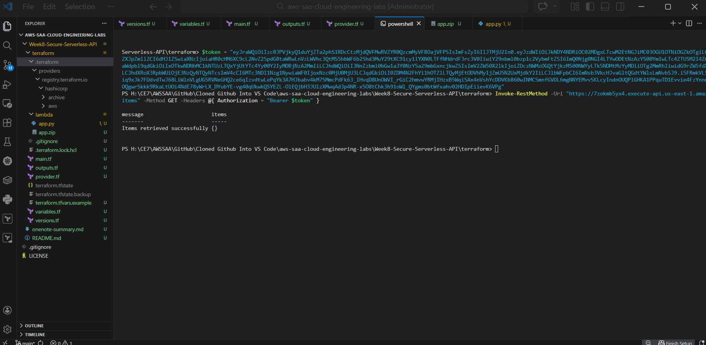
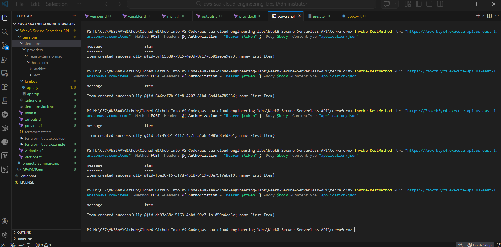
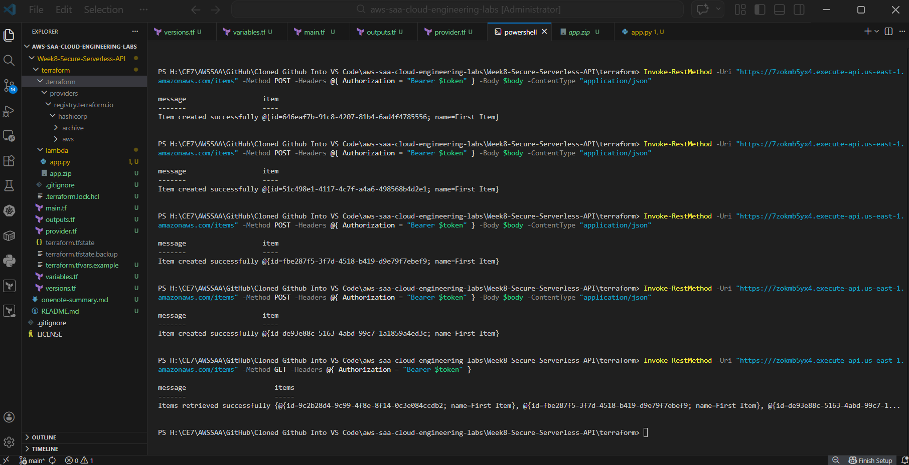

# 🚀 Week 8 — Secure Serverless API (Terraform)

## 📌 Overview

* Fully serverless architecture (no EC2)
* Secure authentication using JWT (Amazon Cognito)
* REST API with API Gateway (HTTP API)
* Scalable backend using AWS Lambda
* NoSQL data storage using DynamoDB
* Infrastructure provisioned using Terraform
* End-to-end testing with authenticated API requests

---

## 🏗 Architecture

* Amazon Cognito → User authentication (JWT)
* API Gateway → Secured endpoints
* Lambda → Business logic processing
* DynamoDB → Data storage
* Terraform → Infrastructure deployment

The Problem Solved:
"Implemented a zero-trust serverless architecture to ensure only authenticated users via Cognito,
 could trigger the business logic in Lambda, preventing unauthorized API calls and managing cost through serverless scaling."

---

## 🔐 Security

* Cognito User Pool authentication
* JWT validation via API Gateway authorizer
* Protected routes (GET / POST)
* No direct access to Lambda or DynamoDB

---

## 🔁 Request Flow

1. User logs in via Cognito
2. Cognito returns JWT token
3. Client sends request with `Authorization: Bearer <token>`
4. API Gateway validates JWT
5. Request forwarded to Lambda
6. Lambda interacts with DynamoDB
7. Response returned to client

---

## 🧪 Testing (Proof)

### ✅ Figure 32 — JWT-authenticated GET (Empty Response)



JWT-authenticated request successfully returned empty dataset.

---

### ✅ Figure 33 — JWT-authenticated POST (Item Creation)



Item successfully created via secured API.

---

### ✅ Figure 34 — JWT-authenticated GET (Data Retrieved from DynamoDB)



Stored items retrieved from DynamoDB via Lambda.

---

## ⚙️ Terraform Commands Used

```bash
terraform init
terraform validate
terraform plan
terraform apply
```

---

## 🚀 How to Deploy

### 📦 1. Initialize Infrastructure

```bash
terraform init
terraform apply
```

---

### 🔐 2. Authenticate via Cognito

```bash
aws cognito-idp initiate-auth --auth-flow USER_PASSWORD_AUTH \
--client-id 76vsnitll5kv4769kofllgr90e \
--auth-parameters USERNAME=<your-email>,PASSWORD=<your-password>
```

---

### 🔑 3. Example JWT Token (Truncated)

```powershell
# Example JWT token (truncated for security)
$token = "eyJraWQiOi...<truncated-jwt-token>...W2"
```

---

### 🔑 4. Call API (GET)

```powershell
Invoke-RestMethod -Uri "https://7zokmb5yx4.execute-api.us-east-1.amazonaws.com/items" `
-Method GET `
-Headers @{ Authorization = "Bearer $token" }
```

---

### 📝 5. Create Item (POST)

```powershell
Invoke-RestMethod -Uri "https://7zokmb5yx4.execute-api.us-east-1.amazonaws.com/items" `
-Method POST `
-Headers @{ Authorization = "Bearer $token" } `
-Body '{"name":"Sample Item"}' `
-ContentType "application/json"
```

---

⚠️ JWT tokens are short-lived and must be generated via Cognito authentication before calling the API.

---

## 📦 Resources Created

* Amazon Cognito User Pool
* Cognito App Client
* API Gateway (HTTP API)
* JWT Authorizer
* AWS Lambda Function
* DynamoDB Table
* IAM Roles and Policies

---

## 🎯 Key Learnings

* Implemented secure JWT authentication using Cognito
* Built protected serverless APIs
* Integrated API Gateway with Lambda
* Performed CRUD operations with DynamoDB
* Used Terraform for infrastructure automation
* Tested APIs using real authentication tokens

---

